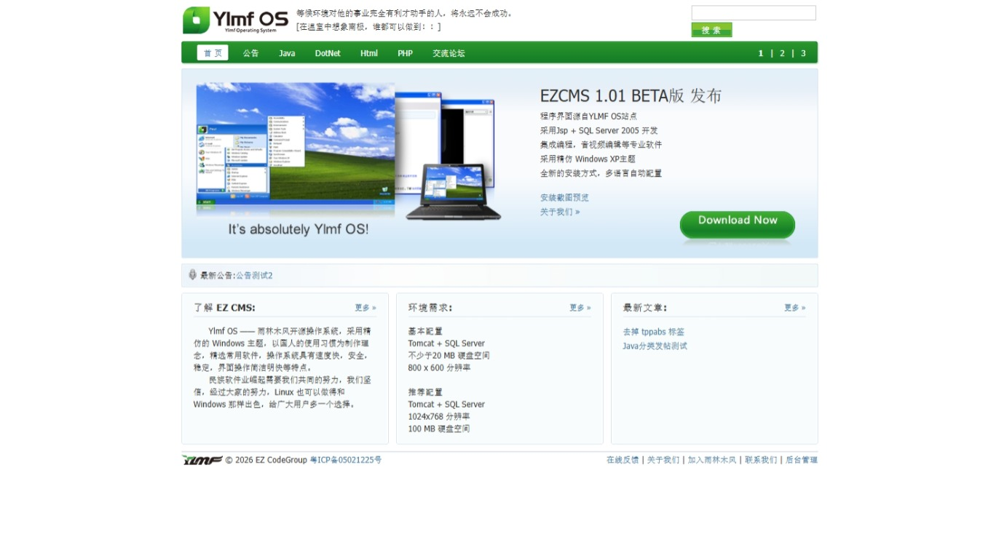
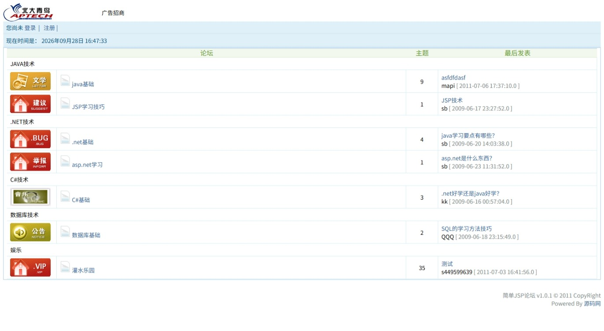

# EZ CMS

**北大青鸟 APTECH** ACCP5.0 学习项目

一套基于JRE1.6 Java Web 技术栈的**内容管理系统（CMS）+ 社区论坛（BBS）**老旧工程，使用 MyEclipse Dynamic Web Project 结构，无 Maven/Gradle 构建脚本。

EZCMS截图：
   

EZBBS截图：
   

- 版本：**EZ CMS v1.0.1 beta**（见 `ezcms/WebRoot/readme.txt`）
- 出品：Powered By EZ Code Group，2011-07-18  @thriken 北大青鸟培训项目
- 授权：**GNU GPL v2**（见根目录 `LICENSE`）

## 目录结构

最初为MyEclipse5.5-9项目，现在是EclipseEE工作空间Workspace

仓库为多工程平铺结构（各有独立 `.project` / `.classpath` / `.mymetadata`）：

| 路径 | 说明 |
| --- | --- |
| `ezcms/` | CMS 主站工程，context-root = `/` |
| `ezbbs/` | jspbbs 论坛工程，context-root = `/bbs` |
| `Servers/` | Eclipse/MyEclipse 的 Tomcat 服务器定义（Tomcat v9.0） |
| `_config.yml` | GitHub Pages / Jekyll 主题配置（jekyll-theme-time-machine） |
| `LICENSE` | GPL v2 全文 |

### ezcms 工程（WebRoot 为 Web 根目录，非 WebContent）

```
ezcms/
├── src/ezcms/
│   ├── entity/            实体类（News, NewsClass, Notice, Admin, Author, SiteInfo, LeftMenu, MainMenu, ManageMenu）
│   ├── dao/               JDBC 版 DAO 接口
│   ├── dao/impl/          JDBC 版 DAO 实现（BaseDao 提供 getConn/executeSQL/closeAll）
│   ├── hibernate/dao/     Hibernate 版 DAO 接口
│   ├── hibernate/dao/impl/ Hibernate 版 DAO 实现
│   ├── utils/             HibernateSessionFactory、MD5、JdbcDriverCleanupListener
│   └── test/              测试入口
├── WebRoot/
│   ├── index.jsp          首页
│   ├── news.jsp           文章详情
│   ├── newslist.jsp       文章列表
│   ├── class.jsp          栏目页
│   ├── search.jsp         搜索
│   ├── about.jsp / about.html / faq.html / snapshot.html / themes.html
│   ├── admin/             后台管理（login.jsp、admin_login.jsp、index.jsp、MenuManage.jsp、inc/、function/）
│   ├── ezadmin/           另一套静态框架后台（index.html + frameset）
│   ├── static/            公共 css / js / jquery / xheditor-1.1.6 编辑器
│   └── WEB-INF/
│       ├── web.xml        Servlet 2.5，注册 ContextLoaderListener、Struts2 过滤器、JdbcDriverCleanupListener
│       └── beans.xml      Spring 2.5 数据源 + Hibernate 3 SessionFactory
├── database/              dbo.sql（SQL Server 导出脚本）、bbs.mdf / bbs_log.LDF
└── WebRoot/readme.txt     版本说明
```

### ezbbs 工程

```
ezbbs/
├── src/ezbbs/{entity,dao,dao.impl,test}/
│   └── 实体：User, Topic, Reply, Board, Message, Parent, BbsInfo, Tip
├── WebRoot/               index.jsp（论坛首页）、list.jsp、detail.jsp、post.jsp、reply.jsp、
│                          login/reg/users/myinfo/msg 等用户相关页，manage/ 为管理后台
├── database/              bbs.sql、ezbbs.mdb
└── “jspbbs论坛”开发文档说明.doc
```

## 技术栈

- JDK **1.7**（`.classpath` 指定 `JavaSE-1.7`） 最初是JDK1.6
- Servlet 2.5 / JSP（`ezbbs` 的 `web.xml` 为 2.4）
- Struts 2.2.3.1（`struts2-core` + `xwork-core` + `struts2-spring-plugin`）
- Spring 3.0 / Spring ORM（`spring.jar`，单包引入）
- Hibernate 3.2（`.hbm.xml` 映射，`spring.orm.hibernate3.LocalSessionFactoryBean`）
- 持久层两种方式并存：**原生 JDBC**（实际在跑）与 **Hibernate**（脚手架，仅映射 `Admin`）
- 模板：JSP Scriptlet + `<%@ include %>`，**未使用 JSTL**
- 富文本：xhEditor 1.1.6；验证码：`WebRoot/img/` 下的 `img1_*.jsp` / `img2_*.jsp`
- 依赖 Jar 手工放置于各工程 `WebRoot/WEB-INF/lib/`（mysql-connector-java 5.1.49、sqljdbc4、commons-dbcp/pool、commons-fileupload、commons-io、log4j 1.2、slf4j、freemarker、ognl、dom4j、javassist、c3p0、aspectj 等）

## 数据库

数据源：

- JDBC：`ezcms/src/ezcms/dao/impl/BaseDao.java`（MySQL 驱动，`getConn()` 使用 MySQL 常量）
- 连接池：`ezcms/WebRoot/WEB-INF/beans.xml`（DBCP `BasicDataSource`）
- 连接串均为**硬编码**常量，修改需重新编译。

数据表（见 `ezcms/database/dbo.sql`）：

| 前缀 | 表 |
| --- | --- |
| `ez_`（CMS） | `ez_Admin`、`ez_Author`、`ez_News`、`ez_NewsClass`、`ez_Notice`、`ez_SiteInfo` |
| `TBL_`（BBS） | `TBL_BBSINFO`、`TBL_BOARD`、`TBL_MESSAGE`、`TBL_PARENT`、`TBL_REPLY`、`TBL_TOPIC`、`TBL_USER` |

> 注意：`dbo.sql` 是 SQL Server 2014 的 Navicat 导出脚本，而代码当前连接的是 MySQL；MySQL 建表请依据该脚本自行转换。`ezbbs/database/bbs.sql` 为 MySQL 版论坛脚本。

## 构建与运行

本项目**没有自动化构建**，由 MyEclipse/Eclipse 增量编译到各自工程的 `WebRoot/WEB-INF/classes`。

1. 用 MyEclipse / Eclipse（带 Web Tools Platform）导入：`Import → Existing Projects into Workspace`，勾选 `ezcms`、`ezbbs`。或EclipseEE直接切换工作空间到文件夹。
2. 按实际环境修改数据库连接常量（`BaseDao.java` 的 `MYURL/MYDBNAME/MYDBPASS`，以及 `beans.xml` 的 `dataSource`）。
3. 导入数据：先在 MySQL 建库 `bbs`，再用转换后的 `dbo.sql`（CMS 表）与 `ezbbs/database/bbs.sql`（论坛表）建表并灌入基础数据。
4. 挂到 Tomcat（推荐 7/8，见下方注意事项）上部署两个工程，context-root 分别为 `/` 与 `/bbs`。
5. 启动后访问：
   - 前台：`http://<host>:<port>/index.jsp`
   - CMS 后台：`/admin/login.jsp`
   - 论坛：`http://<host>:<port>/bbs/index.jsp`

依赖 Jar 已提交进仓库（`ezcms/WebRoot/WEB-INF/lib` 30 个，`ezbbs/WebRoot/WEB-INF/lib` 5 个），无需额外下载——注意根 `.gitignore` 里忽略了 `*.jar`，但文件已在版本库中。

## 已知问题与注意事项

- **数据库方言不一致**：`beans.xml` 的 Hibernate dialect 仍是 `SQLServerDialect`，而 JDBC URL 已切到 MySQL，二者需统一。
- **连接信息硬编码**：用户名/密码写在源码和 `beans.xml` 中，且 root 密码为空，上线前必须外置化配置。
- **双轨 DAO**：`ezcms.dao.impl` 与 `ezcms.hibernate.dao.impl` 两套实现并存，实际页面调用的是 JDBC 版；Hibernate 版仅 `AdminDao`、`AuthorDao`、`NewsDao` 有实现。
- **Struts 未实际使用**：`web.xml` 注册了 `StrutsPrepareAndExecuteFilter` 映射 `*.action`，但 `src/struts.xml` 为空包，源码中也无 Action 类。
- **web.xml 声明 Servlet 2.5**，而 `Servers/` 中配置的是 Tomcat 9（Servlet 4.0）；如需在 Tomcat 9 上跑，建议升级 web.xml 的 schema 或改用 Tomcat 7/8。
- `ezcms/WebRoot/news.jsp.bak`、`ezadmin/`、`faq/`、`static/` 下存在较多遗留/重复资源。
- 无单元测试、无 `.md` 版本的开发文档（`ezbbs` 的《开发文档说明》为 `.doc`）。

## License

GNU General Public License v2.0，详见 `LICENSE`。
